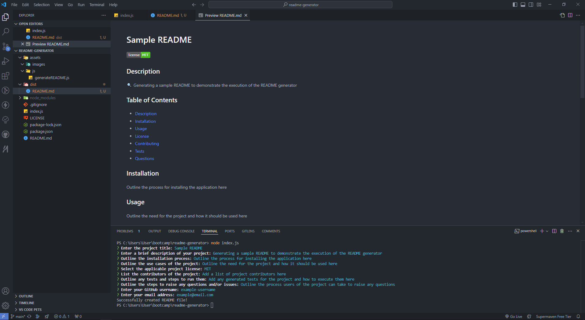

# readme-generator

09-NodeJS/02-Challenge - README generator using NodeJS and Inquirer

## Description

Module 9 - NodeJS: README generator using Inquirer

Development of .md and JavaScript file using NodeJS and Inquirer to create a README file, through the execution of the following:

- user input prompts for project details
- automatic generation of README file
- formatting of README file through the use of Markdown

Project executed in accordance with the following challenge requirements:

### User Story

```md
AS A developer
I WANT a README generator
SO THAT I can quickly create a professional README for a new project
```

### Acceptance Criteria

```md
GIVEN a command-line application that accepts user input
WHEN I am prompted for information about my application repository
THEN a high-quality, professional README.md is generated with the title of my project and sections entitled Description, Table of Contents, Installation, Usage, License, Contributing, Tests, and Questions
WHEN I enter my project title
THEN this is displayed as the title of the README
WHEN I enter a description, installation instructions, usage information, contribution guidelines, and test instructions
THEN this information is added to the sections of the README entitled Description, Installation, Usage, Contributing, and Tests
WHEN I choose a license for my application from a list of options
THEN a badge for that license is added near the top of the README and a notice is added to the section of the README entitled License that explains which license the application is covered under
WHEN I enter my GitHub username
THEN this is added to the section of the README entitled Questions, with a link to my GitHub profile
WHEN I enter my email address
THEN this is added to the section of the README entitled Questions, with instructions on how to reach me with additional questions
WHEN I click on the links in the Table of Contents
THEN I am taken to the corresponding section of the README
```

## Table of Contents

- [Installation](#installation)
- [Usage](#usage)
- [Credits](#credits)
- [License](#license)

## Installation

Install [NodeJS](https://nodejs.org/en) and NPM on your computer to install the required dependencies for this NodeJS application.

Git and an IDE (VSCode recommended) are required to be installed on your computer to clone and view the code for this web application.

From your command line:

```md
### Clone this repository
$ git clone git@github.com:ajhearne-mZAOSW/readme-generator.git

### Navigate into the repository
$ cd readme-generator

### Open in IDE
$ code .
```

In the integrated terminal, run the following commands:

```md
### Install dependencies
npm install

### Run the application
node index.js
```

The application will then prompt you for the information required to generate the README file.

## Usage

The following image shows the web application's appearance and functionality:



A video shows the web process for using the application can be found [here](./assets/images/hearnealana_READMEgenerator.webm)

## Credits

- Learning foudation provided by University of Sydney, USYD-VIRT-FSF-PT-05-2024-U-LOLC/09-NodeJS/01-Activities

## License

MIT
